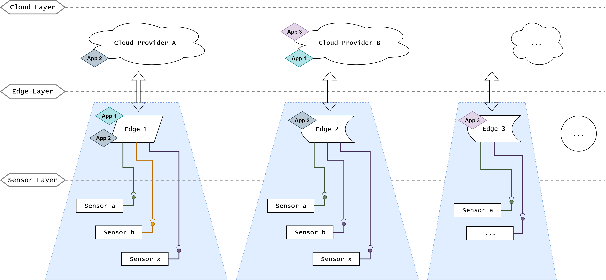
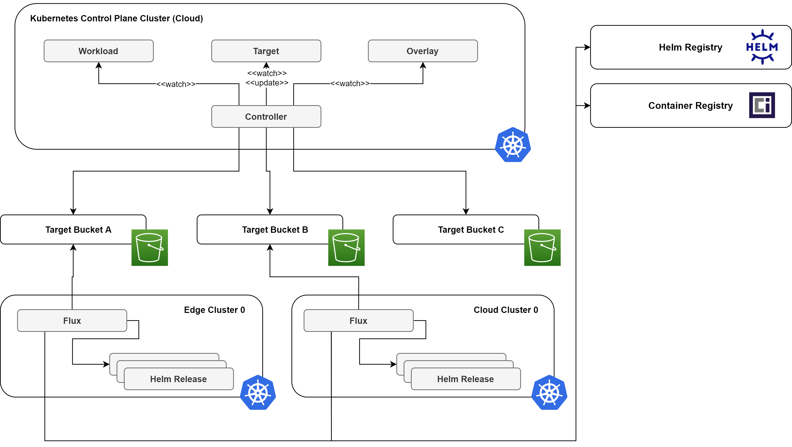
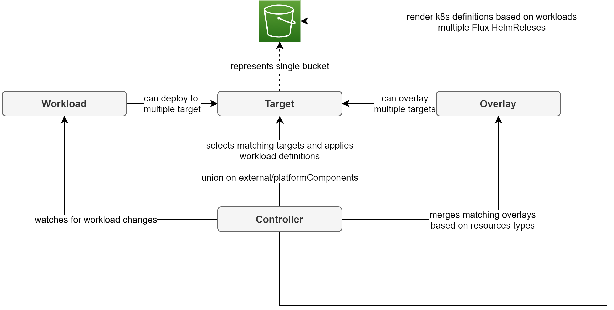

> **Please notice:** the Kontinuum-controller is in a Proof-of-Concept stage and demos the functionality of the underlying concept. The project is not yet ready for usage in any kind of production environment.

The Kontinuum-controller projects provides a Kubernetes controller that extends the Kubernetes API to offer three simple Custom Resource Definitions (CRDs) that can be used by application developers to deploy their applications to a variety of clusters may they reside in the cloud, on the edge or basically anywhere. Additionally platform engineers have the possibility to offer managed components (e.g. databases, key-value stores, message-queues etc.) on the composed application platform that can be used by application teams to offload them from operations and management efforts.

# The problem

Many modern IT application architectures (e.g. in the field of IIoT) are spanning over more than one cloud provider and even across the cloud boundaries towards edges and the things layer. This heterogenous environment generally lacks a holistic application platform offering deployment and management functions. Kubernetes itself has proven its strength when it comes to infrastructure abstraction and container management across a cluster of nodes, but it conveys a lot intrinsic complexity for application teams that just want to deploy. The same is true for platform teams that try to support one or many application developing teams that need to deploy across a diverse fleet of clusters. This is where the Kontinuum-controller comes into play...

The following figure shows a generic IIoT architecture where each cloud and edge notion might be composed of one or multiple Kubernetes cluster:



# Project building blocks

To implement the above mentioned capabilities the Kontinuum-controller leverages:

* [Kubernetes](https://kubernetes.io/): basic infrastructure abstraction layer and container management solution
* [Kubebuilder](https://github.com/kubernetes-sigs/kubebuilder): as its basic framework for controller implementation
* [Helm](https://helm.sh/): as a basic packaging tool and interface for managed components on the platform
* [Flux](https://fluxcd.io/): for the actual deployment manager on the different target clusters 
* S3-compatible object storage: to store and distributed the actual deployment manifests

The Kontinuum-controller is suitable for any application architecture that is deployed along the cloud to things continuum. It leverages a central control-plane cluster where the Kontinuum-controller itself is running as a central hub for managing deployment assignments and platform functionalities like managed components. The actual deployment targets are standalone Kubernetes clusters that fetch their assigned workload manifests from a dedicated S3 bucket. This concept offers support for operation of targets in restricted environments (e.g. industrial plants with limited connectivity) or setups with only sporadic connectivity available.

The figure below shows an overview of the overall platform design and components:



# Benefits

* simple and proven platform building blocks (Helm, Flux, S3 object storage)
* abstracts Kubernetes complexity away from application teams
* minimal dependency between target and control plane trough the abstraction via S3
* targets are able to run autonomously even without any external connectivity (only needed during the time of deployment)
* lightweight management components on target side (single Flux instance), no need for heavyweight management components especially for hardware constraint edge use cases
* holistic deployment over the whole cloud to edge continuum
* platform logic runs isolated on control plane cluster

# Platform interface

The interface for application developers and platform engineers to deploy and provide components on the composed continuum platform are three Kubernetes CRDs and the corresponding Helm charts. The Kontinuum-controller extends the Kubernetes API with the following three objects:

* **Workloads**: main interface for application developers to define and compose their desired application and deploying them to one or multiple targets
* **Target**: represents a single S3 bucket that corresponds to a deployable target cluster
* **Overlay**: offers a way for platform engineers to configure or enforce certain component or application configuration

Application developers use the rather simple format of the _Workload_ CRD to compose their applications without further detailed knowledge about Kubernetes or the deployment targets. Platform engineers on the other hand define deployable target cluster via a definition of a _Target_ resource and component or target specific configuration or enforcements via an _Overlay_ in the control-plane cluster.



#### Workflow

On the control plane cluster:
* Controller constantly watches platform CRDs (_Workload_, _Target_, _Overlay_) for changes
* If a change is detected a subsequent reconcile operation will do the following
  * Grab the updated _Workload_ components and _Overlays_ for the current _Target_
  * Overlay (overwrite and merge) the values of each component with respective value definitions from matching overlays
  * Generate a [Flux HelmRelease](https://fluxcd.io/docs/components/helm/helmreleases/) manifest for each component
  * Upload generated manifests to the respective S3 bucket

On the target clusters:
* Flux watches updates in the assigned S3 bucket constantly
* New manifests (in our case [Flux HelmReleases](https://fluxcd.io/docs/components/helm/helmreleases/)) are applied to the managed cluster

## Platform CRDs

### Workload CRD

```yaml
apiVersion: kontinuum-controller.github.io/v1alpha1
kind: Workload
metadata:
  name: workload-1
spec:
  # Kubernetes label selector which selects the respective target cluster to deploy
  #   the workload to
  selector:
    matchLabels:
      country: switzerland 
      arch: arm
  # A list of components the application is composed of.
  # The 'type' field corresponds to a specific Helm charts that packages the component
  #   of application type.
  # The 'values' objects consists of Helm values the platform engineer can use to provide
  #   configuration options to the application teams.
  components:
  - name: web-server
    type: nginx
    values:
      replicaCount: 1
      [...]
  - name: application
    type: web-application
    values:
      image: registry.example.com/my-application-1:v0.1.1
      replicaCount: 3
      [...]
  # A list of managed components provided by the platform engineers.
  # This object is very similar to the 'components' above with the difference
  #   being that the workload object cannot change the values of these components
  #   as they are configured by the platform itself.
  managedComponents:
  - name: message-broker
    type: rabbitmq
```

### Overlay CRD

```yaml
apiVersion: kontinuum-controller.github.io/v1alpha1
kind: Overlay
metadata:
  name: arm-clusters-switzerland
spec:
  # Kubernetes label selector which selects the respective target cluster to apply
  #   the overlay to
  selector:
    matchLabels:
      country: switzerland 
      arch: arm
  # A list of components that should be overlaid.
  # The 'type' field selects which component the overlay is assigned to.
  # The 'values' objects consists of Helm values the platform engineer can use to provide
  #   additional configuration or overwrite some options for the specific type.
  components:
  - type: nginx
    values:
      service:
        type: ClusterIP
      [...]
  - name: application
    type: web-application
    values:
      updateStrategy:
        type: RollingUpdate
      [...]
  # A list of managed components to be configured by this overlay.
  # Trough this mean, the platform engineers can provide configuration for the
  #   managed components offered on the platform.
  managedComponents:
  - type: rabbitmq
    values:
      persistence:
        enabled: false
      service:
        type: ClusterIP
```

### Target CRD

```yaml
apiVersion: kontinuum-controller.github.io/v1alpha1
kind: Target
metadata:
  name: edge-custer-1
  # Hold the labels used for 'Workload' and 'Overlay' matching
  labels:
    country: switzerland 
    arch: arm
spec:
  # Configure for the referenced S3 bucket that holds and distributes the
  #   generated deployment manifests.
  s3:
    credentialSecretName: edge-custer-1-s3-secret
    bucketName: edge-custer-1
    folder: manifests
    region: eu-central-1
```